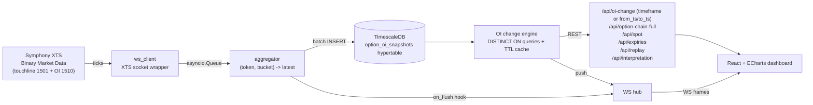
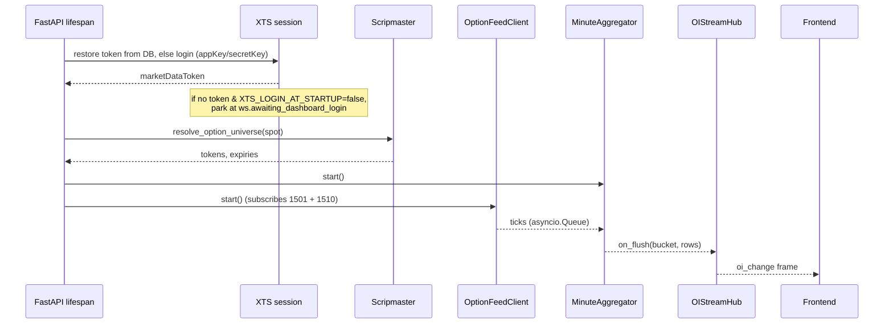

# Architecture

## High-level



## Boot sequence



## Why TimescaleDB and not plain Postgres?

* **Hypertable** automatically partitions `option_oi_snapshots` by day,
  keeping recent chunks fast and old chunks cheap to compress later.
* **Continuous aggregates** (`oi_1h`) precompute hourly `last(oi)` to satisfy
  "Last 1 Hr" / "Full Day" queries in O(1) instead of scanning the whole day.
* **`time_bucket` + `last()` aggregates** beat `DISTINCT ON` on giant tables.

## Why `DISTINCT ON (strike, option_type)` for the change engine?

Both the "now" and "then" snapshots want a single canonical row per
`(strike, option_type)`:

```sql
SELECT DISTINCT ON (strike, option_type) oi, ltp, ts
FROM   option_oi_snapshots
WHERE  expiry = :exp AND ts <= :cutoff
ORDER  BY strike, option_type, ts DESC;
```

With the composite index `(expiry, strike, option_type, ts DESC)` this is an
index-only walk — sub-millisecond on a day's data.

## Why the aggregator and not raw inserts?

The XTS market-data stream emits multiple ticks per second per token. Storing
each tick wastes most of the disk and produces no extra information for OI
analytics. The aggregator keeps only the **latest tick per (token, bucket)** and
flushes closed buckets in batched inserts.

The bucket size is configurable via `PERSIST_BUCKET=1s|5s|1min`:

* **`1s` (the Windows-local default in this build).** Required for the
  **sub-minute timeframes** (`1s`, `15s`, `30s`, `45s`): the OI-change engine
  diffs the latest snapshot against the snapshot one window ago, so a snapshot
  must exist *between* `now` and `now - window`. With `1min` buckets there is no
  intra-minute snapshot, so sub-minute deltas come back flat (0).
* **`5s`** — sub-minute timeframes ≥ 5s still work; ~5× fewer rows than `1s`.
* **`1min`** — smallest storage, but `1s/15s/30s/45s` deltas are always 0.

A bucket change takes effect on backend restart.

## Reconnect & failure model

| Component              | Failure mode | Recovery |
|------------------------|--------------|----------|
| XTS market-data login  | Network blip | retries with backoff; falls back to dashboard login if token can't be obtained |
| XTS socket             | Gateway drops every ~83s | Auto-reconnect; OI carried forward across reconnects, `OI=0` artifacts ignored so data stays clean |
| Market-data token      | Expired      | Restore from `auth_sessions`; else re-login (startup flag or dashboard) |
| Aggregator DB error    | TS down      | Buckets retained in memory, retried next iteration |
| Frontend WS            | Backend down | `OIStream` reconnects with jittered backoff up to 30s |

## Data semantics

* **Spot price** is *not* persisted as its own row. We sample it from the NIFTY
  50 index token (XTS NSECM `26000`, configurable via `NIFTY_INDEX_TOKEN`) into
  `Tick(option_type='IDX')` and stamp the value onto every option tick before it
  lands in the aggregator, so each row in `option_oi_snapshots` already carries
  the matching underlying.
* **OI Change** comes in two flavours, both served by
  `services/oi_change.OIChangeEngine`:
  * **Preset timeframe** — `OI(now) - OI(now - timeframe)` per strike per side
    (`?timeframe=5m`). `full_day` baselines against the first snapshot at/after
    market open.
  * **Sub-minute (`1s/15s/30s/45s`) — "hold last change".** The XTS feed only
    disseminates OI ~once per minute, so an exact sub-minute window is flat ~75%
    of the time. For these timeframes the engine carries the baseline back to
    each strike's most recent OI move (within a 5-min horizon) when the exact
    window shows no change, so the delta persists between feed updates instead of
    dropping to 0. `1m`+ are unaffected (they already span an update).
  * **Custom window** — `OI(to) - OI(from)` over an explicit range
    (`?from_ts=...&to_ts=...`, both ISO-8601). Omit `to_ts` for an open-ended,
    live, left-anchored window (`now` edge). Drives the dashboard's dual-handle
    time-range slider. `engine.get_range()` reuses the same `DISTINCT ON`
    snapshot queries as the timeframe path.

## Caching

`OIChangeEngine` keeps a TTL cache (`30s`). The timeframe path keys on
`(timeframe, expiry, symbol, anchor_ts)` and the range path on
`(from, to, expiry, symbol, anchor_ts)`, where `anchor_ts = MAX(ts)` for the
symbol+expiry. Because `anchor_ts` advances on every aggregator flush, new ticks
naturally invalidate stale entries while post-close data stays stable. A live
spot update is grafted onto a cached response without recomputing.
