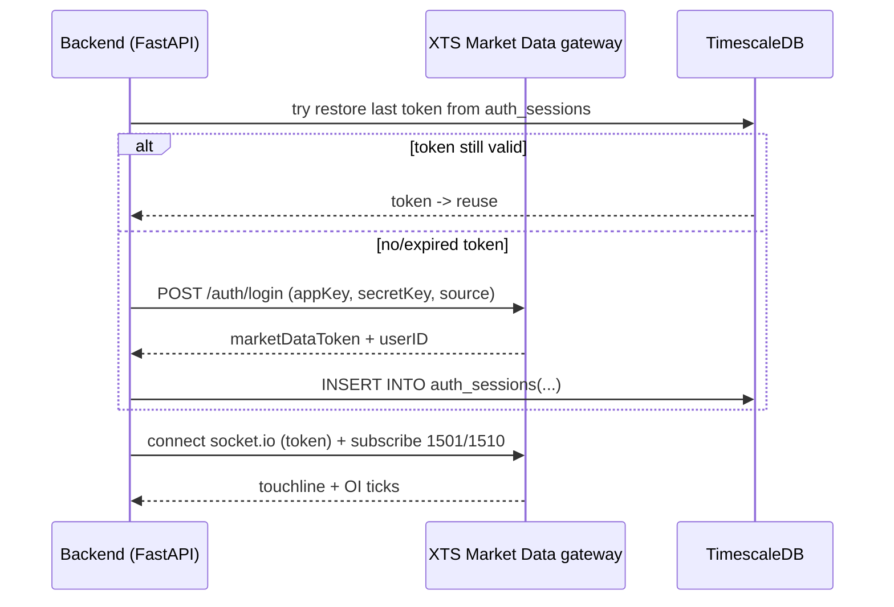

# Authentication

This platform authenticates against the **Shrilakshmi Fintech / Symphony XTS
Market Data API**, server-side. There is no browser redirect and no per-user
login — the backend obtains a market-data token directly from the XTS gateway
using an **appKey + secretKey** pair issued for your account.

> **Market data only.** This build consumes the *Binary Market Data* API
> (touchline `1501` + open-interest `1510` streams). It does **not** place
> orders, so no interactive/trading login, client code, MPIN, or TOTP is
> involved.

## Required credentials

Fill these in `.env` (see [`.env.example`](../.env.example)):

```
XTS_MD_BASE_URL=https://developers.symphonyfintech.in/apibinarymarketdata
XTS_MD_APP_KEY=your_marketdata_app_key
XTS_MD_SECRET_KEY=your_marketdata_secret_key
XTS_MD_SOURCE=WebAPI
XTS_MD_BROADCAST_MODE=Full
XTS_MD_PUBLISH_FORMAT=JSON
```

### Where do these come from?

| Variable            | Source |
|---------------------|--------|
| `XTS_MD_BASE_URL`   | Your broker's market-data host. The default above is the Symphony demo host; live brokers (e.g. Shrilakshmi / `trades.lakshmishree.com`) publish their own host. |
| `XTS_MD_APP_KEY`    | Broker API dashboard → subscribe to **Binary Marketdata API** → emailed `appKey`. |
| `XTS_MD_SECRET_KEY` | Same email as the `appKey` (the matching `secretKey`). |

Market-data login needs **only** the `appKey` + `secretKey`. The `SOURCE`,
`BROADCAST_MODE`, and `PUBLISH_FORMAT` values rarely need changing.

## Login flow at runtime



## Manual vs. unattended login

Login is **manual by default** (`XTS_LOGIN_AT_STARTUP=false`):

1. On boot the backend first calls **`try_restore_session_from_db`** — if a
   valid token row exists in `auth_sessions`, the feed reconnects with no
   interaction.
2. If restore fails, the feed parks at **`ws.awaiting_dashboard_login`** and
   waits. Trigger a fresh login from the dashboard **Connect** button or with:

   ```bash
   curl -X POST http://localhost:8000/api/auth/login
   ```

   (The legacy form fields `client_code` / `mpin` / `totp_code` are accepted but
   ignored — the XTS session authenticates with the `appKey` / `secretKey` from
   `.env`.)

For **unattended servers** (VPS / Docker / Task Scheduler), set
**`XTS_LOGIN_AT_STARTUP=true`** so the backend logs in from `.env` on startup
without needing the dashboard. See [DEPLOY.md](DEPLOY.md).

Relevant timeouts (in `.env`):

| Variable                  | Default | Meaning |
|---------------------------|---------|---------|
| `SMARTAPI_LOGIN_TIMEOUT_S` | `45`   | Max seconds `POST /api/auth/login` waits for the XTS login. |
| `DB_PERSIST_TIMEOUT_S`     | `20`   | Max seconds to persist the new session row. |
| `XTS_LOGIN_AT_STARTUP`     | `false`| `true` = log in from `.env` on startup (unattended). |

## The XTS socket drops every ~83 seconds

The XTS gateway server-side disconnects and reconnects the market-data socket
roughly every **83 seconds**. This is a property of the gateway, not a bug in
this app. The ingest pipeline is hardened to be immune: it **carries OI forward
across reconnects** and **ignores `OI=0` artifacts** emitted on reconnect, so
stored data stays clean. The disconnects themselves are expected; you will see
`feed_connected` flip between `true`/`false` in `/api/health`.

## Common errors

| Symptom                                   | Likely cause |
|-------------------------------------------|--------------|
| Feed stuck at `ws.awaiting_dashboard_login` | No valid token. Click **Connect** on the dashboard or `POST /api/auth/login`. After a container recreate this is expected when `XTS_LOGIN_AT_STARTUP=false`. |
| `401` / `Invalid appKey or secretKey`     | Wrong/blank `XTS_MD_APP_KEY` / `XTS_MD_SECRET_KEY`, or pointing `XTS_MD_BASE_URL` at the wrong host (demo vs. live). |
| Login succeeds but no ticks               | Subscription limit exceeded for the appKey (see below), or outside market hours. |
| `feed_connected` flaps every ~80s         | Normal — the gateway's periodic reconnect (see above). |

## Subscription limits

XTS counts subscriptions against an **appKey-specific limit** (configurable on
the broker dashboard; some plans default to as few as **50**). With
`STRIKE_WINDOW=50` the option universe is ~200 instruments, each subscribed on
two message codes (touchline `1501` + open-interest `1510`). Ensure your appKey
allows enough subscriptions, or lower `STRIKE_WINDOW`.

> **Note:** `/api/health` reports `auth_mode: "totp"` — that string is a legacy
> field name left over from the Angel One era. The active integration is the XTS
> appKey/secretKey flow described here.
